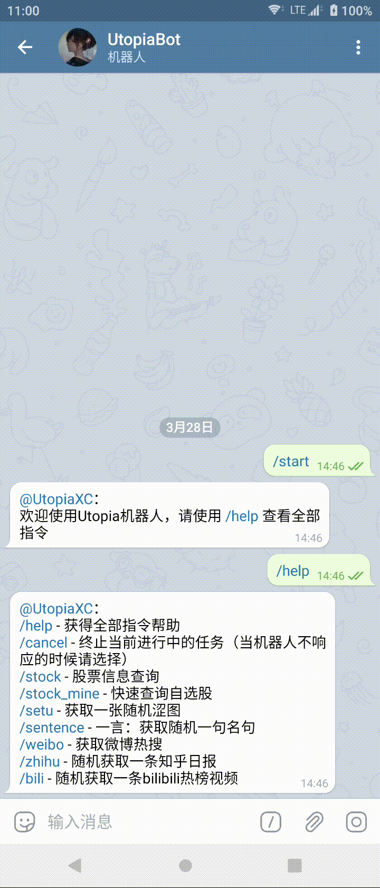
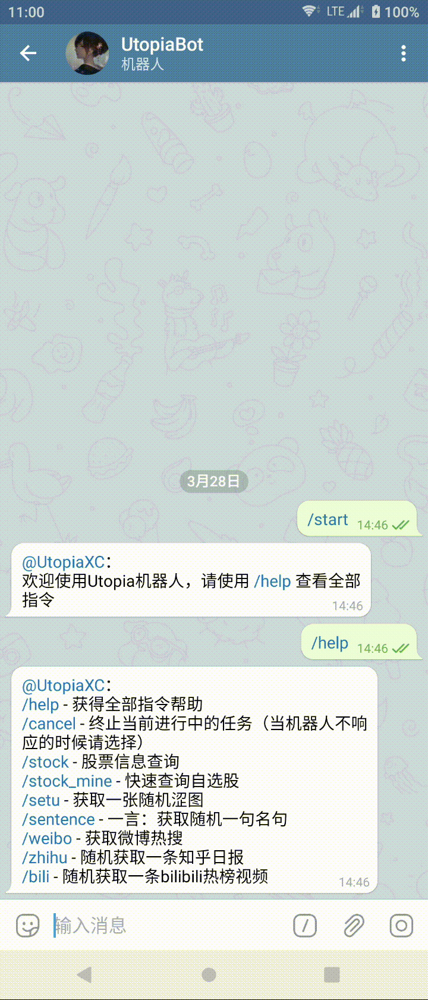
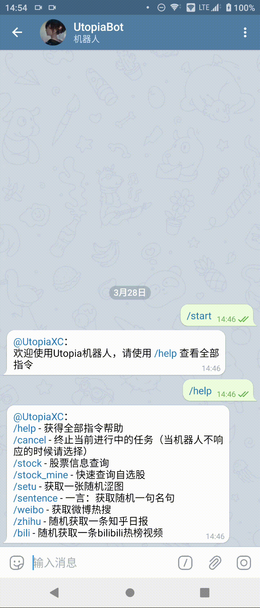

# Utopia Bot For Telegram

[](https://github.com/UtopiaXC/Utopia-Bot-For-QQ/blob/master/LICENSE)
[](https://www.python.org/downloads/)
[](https://jq.qq.com/?_wv=1027&k=JgJPM4Rv)
[](https://t.me/gugugu_club)  

这是一个由Python实现的基于[python-telegram-bot](https://github.com/python-telegram-bot/python-telegram-bot)框架的Telegram机器人  

本项目原型[Utopia-Bot-For-QQ](https://github.com/UtopiaXC/Utopia-Bot-For-QQ)，由于QQ诸多限制，现全面转向Telegram  

机器人实例：[@UtopiaXA_bot](https://t.me/UtopiaXA_bot)  

 ## 目录

1. [简介](#简介)
2. [接口使用](#接口使用)
3. [部署](#部署)
4. [自定义模块](#自定义模块)   
5. [功能](#功能)
6. [注意](#注意)
7. [开源许可与免责声明](#开源许可与免责声明)

## 简介

本项目完全由Python实现。依托于开源Telegram机器人框架python-telegram-bot开发。  
本项目代码难度是非常非常非常低的  
目前仅实现了部分计划功能，更多功能正在开发  
部署前请对用到的API进行调试  
功能计划：

- [x] 查看全部指令
- [x] 一言
- [x] 涩图自动机
- [x] 知乎日报
- [x] 英语句子（词霸来源）
- [x] 微博热搜
- [x] 哔哩哔哩热门视频
- [ ] 天气查询
- [x] 证券
    - [x] 股票实时查询
    - [x] 自选股
    - [x] 基金查询
    - [ ] 热点新闻  
- [ ] 每日考研英语（何凯文来源）
- [ ] NLP聊天机器人
- [ ] 自动成员清理
- [ ] 历史上的今天
- [ ] 每日新闻
- [ ] 小游戏
- [ ] 等等等等还在考虑

## 接口使用

1. 句子接口：[一言·Hitokoto](https://hitokoto.cn/)  
   本接口使用方法请查阅官方文档，这里不再赘述
2. 涩图接口：[Lolicon API](https://api.lolicon.app/#/setu)  
   使用本接口时请注意：  
   使用前请使用接口官网的提供的Telegram机器人申请apikey，请求的时候需要带上此参数。  
   本接口返回的是Pixiv图片链接而不是图片原图，所以当你发现该机器人在部署好之后无法发送图片请保证运行该机器人的服务器能正常访问Pixiv。  
   此外，本接口存在R18内容，请自行过滤并带上相关参数。
3. 知乎日报：[知乎官方API](https://news-at.zhihu.com/api/3/stories/latest)  
   本接口为知乎日报的官方API，每次返回全部日报信息，本机器人每次发送仅选择一个发送。
4. 英语句子：[金山词霸每日英语](http://sentence.iciba.com/index.php?c=dailysentence&m=getdetail&title=2020-01-01)  
   本接口为金山词霸每日英语接口，每次返回一句英语，请注意title参数，该参数为获取句子的日期。机器人默认选取当天至当天前六百天内的任意一天进行爬取
5. 微博热搜：暂时由爬虫实现  
   一个无害的小型的网页爬虫。
6. 哔哩哔哩热门视频：[哔哩哔哩官方接口](https://api.bilibili.com/x/web-interface/popular?ps=1&pn=1)  
   哔哩哔哩的官方热榜接口。   
   此处需要注意的是ps为每次获取的视频信息个数，pn为起始视频的实时热榜排名。  
   因此在机器人中pn为1~50随机生成的来保证每次都能取到前50内不同的视频
7. 股票接口：[雪球](https://xueqiu.com/)  
    通过调用雪球搜索接口获取cookie维持session后访问数据接口。
## 部署

- ### 部署Python环境
    1. 项目需要Python3，请保证您的服务器Python版本正确
    2. 需要安装库：python-telegram-bot（框架）、requests（用于爬虫请求）、beautifulsoup4（用于爬虫页面分析）  
        ```pip install python-telegram-bot requests beautifulsoup4``` 

- ### 部署 Utopia Bot
    1. 选择一个合适的文件夹来准备放置项目文件
    2. 使用Git命令将项目克隆到本地，即  
       ```git clone https://github.com/UtopiaXC/Utopia-Bot-For-Telegram.git```
    3. 进入文件夹，即  
       ```cd Utopia-Bot-For-Telegram/bot```
    4. 启动bot服务，即  
       ```python3 bot.py ```

- ### 参数设定
    1. 请在部署机器人前对配置文件中的参数进行修改
    2. 配置文件：bot/config.py
    3. 请按照文件内注释对参数进行修改  
  
- ### 注意
    1. Bot需要常驻运行，请使用守护进程或screen

## 自定义模块
由于python-telegram-bot框架提供了非常完整的接口封装，您可以非常快速地添加属于自己的功能模块。  
如果您想除去本实例的模块，您只需要将module文件夹中的对应文件删除并在bot.py中删除导入包与初始化函数即可  
您可以参照[官方demo](https://github.com/python-telegram-bot/python-telegram-bot/tree/master/examples)或本实例进行自己的模块的编写

## 功能
1. ### 开始与帮助

   用于显示全部指令并通过Telegram特性来快速进入相关功能

   

   

2. ### 一言

   通过一言接口获取相关句子并提供分类选项

   

   

3. ### 涩图

   通过LoliconAPI的涩图接口获取一张涩图并提供R18选项

   

   

4. ### 日报

   随机获取一条知乎日报

   

   

5. ### 英语句子
   

6. ### 微博热搜

   获取完整的微博热搜榜单

   

   

7. ### 哔哩哔哩热门视频

   随机获取一条哔哩哔哩热榜视频

   

   

8. ### 股票

   1. 功能一：搜索

      通过关键字进行股票搜索并展示

      

   2. 功能二：添加自选

      添加一个自选股，数据采用SQLite数据库保存

      通过关键字进行股票搜索并展示

      

   3. 功能三：删除自选

      删除一个自选股

      通过关键字进行股票搜索并展示

      

   4. 功能四：查看自选股详情

      查看一条自选股的全部实时详情及简要K线信息

      通过关键字进行股票搜索并展示

      

   5. 功能五：查看全部自选股简报

      查看全部自选股的简要信息

      通过关键字进行股票搜索并展示

      

   6. 功能六：快速指令查看自选股简报

      通过快速指令查看全部自选股简要信息

      通过关键字进行股票搜索并展示

      
    

## 注意

1. 请注意，涩图接口存在R18内容，已添加选择
2. 如果对Telegram API或python-telegram-bot有疑问，请到原作者Git提Issue
3. 如果功能中截图无法查看，请使用全局代理后查看
4. 因为我比较懒，所以日志都是随便写的，看不惯建议自己改

## 开源许可与免责声明

本项目源码均采用MIT开源许可。源码设计仅作学习用途，严禁用于商业用途与其他违法用途。一切后果由使用者承担。